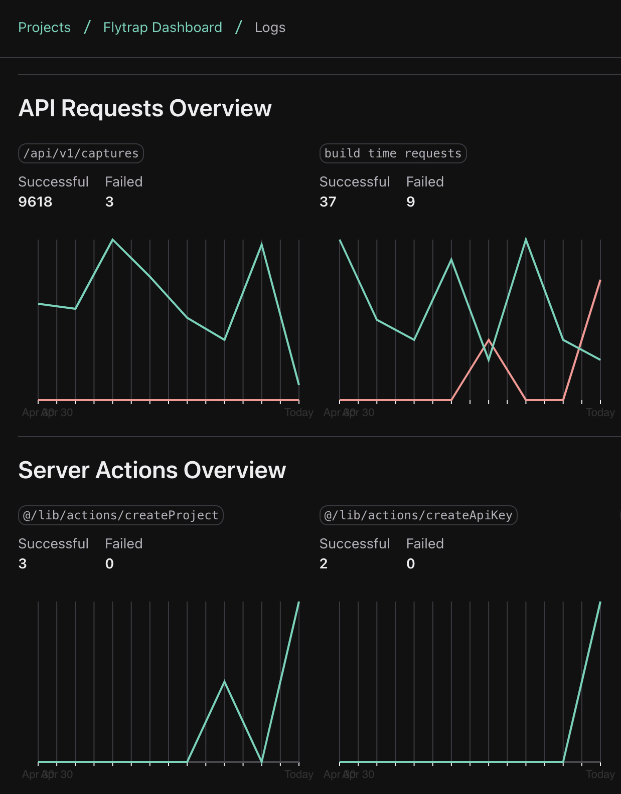
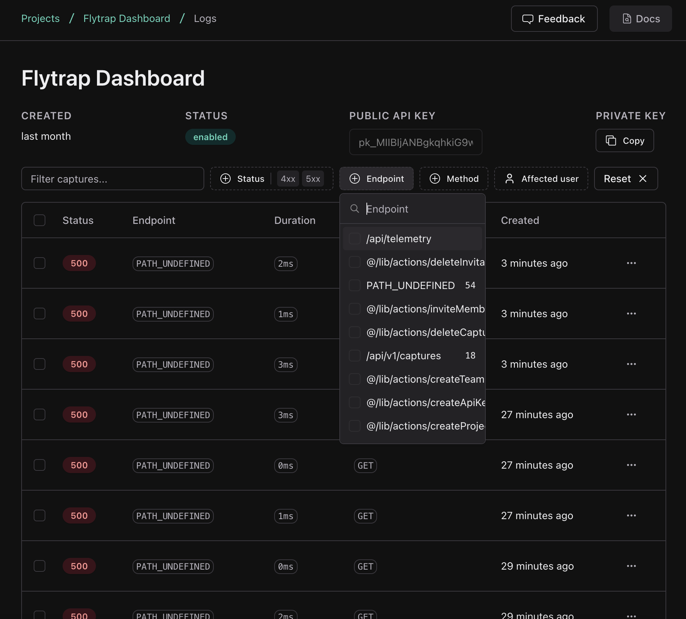
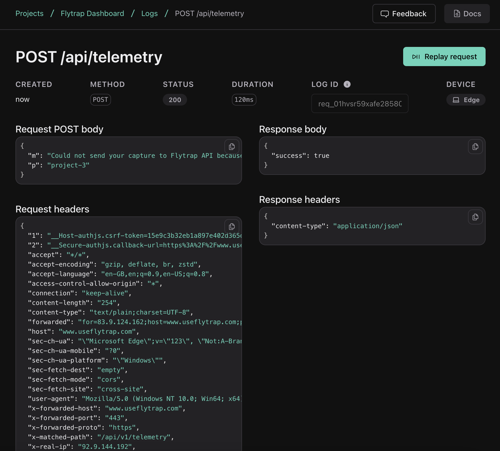
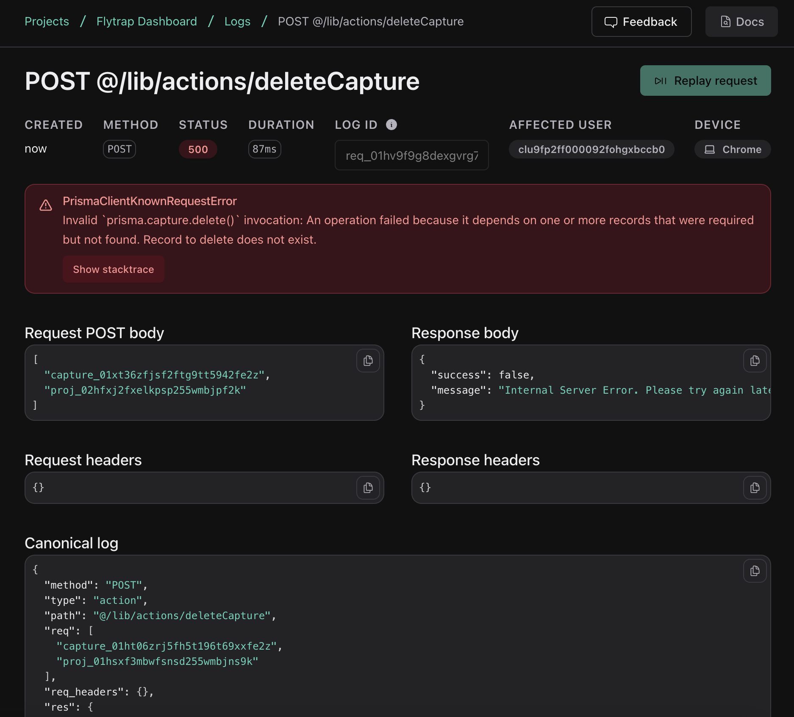
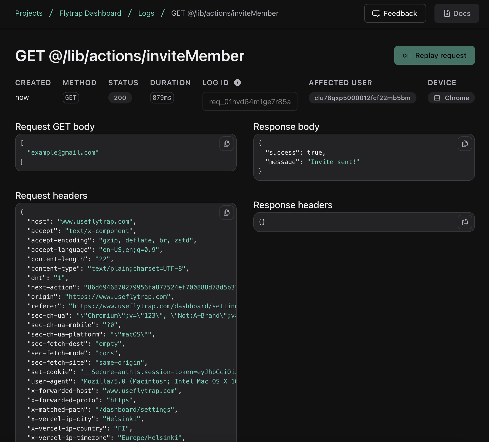

<a href="https://useflytrap.com">
  
</a>

<div align="center">
  <a href="https://discord.gg/tQaADUfdeP">💬 Join our Discord</a>
  <span>&nbsp;&nbsp;•&nbsp;&nbsp;</span>
  <a href="https://x.com/useflytrap">𝕏 Follow us</a>
  <br />
</div>

## Flytrap Logs

[![npm version][npm-version-src]][npm-href]
[![npm downloads][npm-downloads-src]][npm-href]
[![Github Actions][github-actions-src]][github-actions-href]

> Open-source full-stack error monitoring for Next.js apps

Flytrap Logs is a full-stack error monitoring tool, that monitors your Server Actions, Route Handlers & React components, alerts you when your system health is degraded, and provides you context from tools and libraries you use such as Prisma, Drizzle, Supabase, Auth.js to help you fix bugs & outages faster. [Read more →](https://useflytrap.com/blog/error-monitoring-i-want)

> **Flytrap Logs is under active development.** Flytrap Logs is an ongoing effort to build a much more developer friendly error monitoring and debugging experience. Some features are not yet built. Open an issue or join our Discord to suggest features and follow our progress. [Check out our Roadmap →](#-roadmap)

## Features

- Monitors Server-rendered pages, API Routes, Server Actions & React components. [Learn more →](#-monitoring-server-rendered-pages-api-routes-server-actions--react-components)
- Saves context from libraries you use (eg. Prisma, Drizzle, Supabase, Stripe, Auth.js) to make debugging easier. [Learn more →](#%EF%B8%8F-automatic-context-from-your-tools)
- Type-safe structured canonical logging [Learn more →](#-type-safe-canonical-logging)
- Encryption for log data [Learn more →](#-encryption-for-log-data)

## ⚡️ Quickstart

1. Install the Flytrap Logs SDK
```sh
$ npm install @useflytrap/logs
```

2. Install the Next.js plugin
```sh
$ npm install -D @useflytrap/logs-transform
```

3. Add the plugin to `next.config.js`

```javascript
const { nextjs } = require('@useflytrap/logs-transform')

/** @type {import('next').NextConfig} */
const nextConfig = {
  webpack: nextjs({
    // 👈 plugin options here
  })
}

module.exports = nextConfig
```

4. Create a logging file (`logging.ts`)

In your logging file, you can codify your logs with TypeScript, enable encryption, configure the log API endpoints and more.

> 🚨 Remember to export all the functions as shown below

```typescript
import { PermissionedApiKey } from "@/types"
import { createFlytrapLogger } from "@useflytrap/logs"

export type AdditionalLogContext = {
  team_id: string
  project_id: string
  auth_type: "api_key" | "dashboard"
  permissions_used: PermissionedApiKey["permissions"]
  build_id: string
  key_id: string
}

export const {
  addContext,
  flushAsync,
  flush,
  catchUncaughtAction,
  catchUncaughtRoute,
  response,
  nextResponse,
  json,
  nextJson,
  redirect,
  nextRedirect,
  parseJson,
  parseText,
} = createFlytrapLogger<AdditionalLogContext>({
  publicKey:
    "pk_MIIBI...",
  encryption: {
    enabled: true,
  },
})
```

Your code-base will now automatically emit log data from Server-rendered pages, API routes, Server Actions & React components.

Try making a request, and you should see requests & server actions get logged in the console. If you want to send them to an API, you can change the `flushMethod` to `'api'` in your `logging.ts`, and define `logsEndpoint` with your API endpoint.

You can manually add context to your log data using the `addContext` function like this:

```typescript
const apiKey = assertApiKey(headers())
addContext({
  auth_type: "api_key",
  key_id: apiKey.id,
})
```

## 📈 Monitoring Server-rendered pages, API Routes, Server Actions & React components

The Flytrap Logs code-transform automatically wraps your SSR pages, API routes, Server Actions & React components to capture errors that happen in them. It also automatically gathers useful context that can be used when fixing bugs.

#### What context is automatically captured
- **SSR pages:** request headers, params, duration, path, status code, uncaught errors
- **API routes:** request & response payload, request & response headers, duration, path, status code, uncaught errors
- **Server Actions:** input data, response object, headers, duration, path, status code, uncaught errors

<details>
  <summary>
    How SSR pages are transformed
  </summary>

```diff
+ import { catchUncaughtPage } from "./lib/logging"

- export default function Home() {}
+ export default catchUncaughtPage(function Home() {}, {
+  path: "/"
+})
```

#### Notes
- The `catchUncaughtPage` doesn't affect the runtime nature of your code at all, if bubbles any caught errors up, so error boundaries work perfectly.
- Only React Server Component pages are transformed.
</details>

<details>
  <summary>
    How API routes are transformed
  </summary>

```diff
+ import { catchUncaughtRoute } from "@/lib/logging"

- export function GET() {}
+ export const GET = catchUncaughtRoute(function GET() {}, {
+  path: "/"
+})
```

#### Notes
- The `catchUncaughtRoute` doesn't affect the runtime nature of your code at all, it bubbles any caught errors up
- Only React Server Component pages are transformed.
</details>


## 🛠️ Automatic context from your tools

The worst thing that can happen when trying to fix a bug is not having enough context. Because of this, Flytrap logs automatically adds context from your libraries such as Prisma, Drizzle, Supabase, Auth.js, Stripe & more, so when you have enough context when fixing bugs.

Here's an example to illustrate how context gets added to an Auth.js call on the server side:

```diff
import { auth } from "@/lib/auth"
+ import { addContext } from "@/lib/logging"

export async function getCurrentUser() {
  const session = await auth()

+  if (session) {
+    addContext({
+      'auth.js': {
+        user_id: session.user.id,
+        user_email: session.user.email
+      }
+    })
+  }

  return session?.user
}
```

Boom! Now your bug reports will automatically contain the authenticated user.

Here's another example with Supabase:

```diff
import { auth } from "@/lib/auth"
+ import { addContext } from "@/lib/logging"

export async function findUserById(userId: string) {
  const session = await auth()

  const { data: { users }, error } = await supabase.auth.admin.listUsers()

+ if (error) {
+   addContext({
+     'supabase': { error } // 👈 error context saved automatically
+   })
+ }
+ addContext({
+   'supabase': {
+     'supabase.auth.admin.listUsers()': users // 👈 fetched users saved to make bug-fixing easier
+   }
+ })

  return users.find(({ id }) => id === userId)
}
```

## 🪵 Type-safe canonical logging

[Canonical logging](https://stripe.com/blog/canonical-log-lines) is a way of doing structured logging at scale, popularized by Stripe, where each action produces one log line, which contains all the necessary context to fix bugs, associate log lines with users, API keys or organizations, monitor latencies and more.

It's a really good way to handle logs and easy to work with and extend. You can use TypeScript to make your canonical logs fully type-safe.

Here's an example:

```typescript
import { PermissionedApiKey } from "@/types"
import { createFlytrapLogger } from "@useflytrap/logs"

export type AdditionalLogContext = {
  team_id: string
  project_id: string
  auth_type: "api_key" | "dashboard"
  permissions_used: PermissionedApiKey["permissions"]
  build_id: string
  key_id: string
}

export const {
  getContext,
  addContext,
  flush,
  flushAsync,
  catchUncaughtAction,
  catchUncaughtRoute,
  response,
  nextResponse,
  json,
  nextJson,
  redirect,
  nextRedirect,
  parseJson,
  parseText,
} = createFlytrapLogger<AdditionalLogContext>({
  publicKey:
    "pk_MIIBI...",
  vercel: {
    enabled: true,
  },
  encryption: {
    enabled: true,
  },
})
```

Here we're adding keys such as `team_id`, `key_id`, `build_id`, `permissions_used` so we can easily find logs filtered by team, API key and more.

To manually add this context to our canonical log lines during execution of Server Actions or API Routes, we can use the `addContext` function.

```typescript
import { addContext, json } from "@/lib/logging"
import { db } from "@/lib/db"
import { Err, Ok } from "ts-results"

async function assertUserInTeam(teamId: string, userId: string) {
  const team = await db.teamMember.count({
    where: {
      teamId,
      userId,
    },
  })

  if (team === 0) {
    return Err(
      json(
        {
          message: `You're trying to access resources for team with ID "${teamId}" without having access to it.`,
        },
        { status: 401 }
      )
    )
  }
  addContext({
    team_id: teamId,
  })
  return Ok(true)
}
```

## 🔐 Encryption for log data

To enable encryption for log data, simply add `encryption.enabled` to `true` in your `logging.ts` file, and your public key as the `publicKey` key. This uses the public key to encrypt the log data.

By default, keys `req`, `req_headers`, `res`, `res_headers` & `error` are encrypted. If you want to add other keys to encrypt, simply add them to the `encryption.encryptKeys` key as an array:

```typescript
export const {
  // ... omitted for brevity
} = createFlytrapLogger<AdditionalLogContext>({
  publicKey:
    "pk_MIIBI...",
  vercel: {
    enabled: true,
  },
  encryption: {
    enabled: true,
    encryptKeys: ['api_key', 'user_id', 'user_email']
  },
})
```

## 🐛 Sending data to Flytrap Logs Dashboard

If you want automatically set-up dashboards for your Route Handlers, Server Actions that look like this 👇, you can integrate our Logs SDK with the Flytrap Logs Dashboard.

| | | |
|:-------------------------:|:-------------------------:|:-------------------------:|
| |  ||
|  |  ||
||||

1. Sign up on [Flytrap](https://www.useflytrap.com/register)
2. Create a project, select the "Logs" product during the onboarding
3. Create your `logging.ts` file, and add the `publicKey` from your onboarding there.
4. Set the `flushMethod` in your `logging.ts` file to `'api'`

## 🚧 Roadmap

TODO!

## 💻 Development

- Clone this repository
- Enable [Corepack](https://github.com/nodejs/corepack) using `corepack enable` (use `npm i -g corepack` for Node.js < 16.10)
- Install dependencies using `pnpm install`
- Run the tests using `pnpm dev`

## License

Made with ❤️ in Helsinki, Finland.

Published under [MIT License](./LICENSE).

<!-- Links -->

[npm-href]: https://www.npmjs.com/package/@useflytrap/logs
[github-actions-href]: https://github.com/useflytrap/flytrap-logs/actions/workflows/ci.yml

<!-- Badges -->

[npm-version-src]: https://badgen.net/npm/v/@useflytrap/logs?color=black
[npm-downloads-src]: https://badgen.net/npm/dw/@useflytrap/logs?color=black
[prettier-src]: https://badgen.net/badge/style/prettier/black?icon=github
[github-actions-src]: https://github.com/useflytrap/flytrap-logs/actions/workflows/ci.yml/badge.svg
